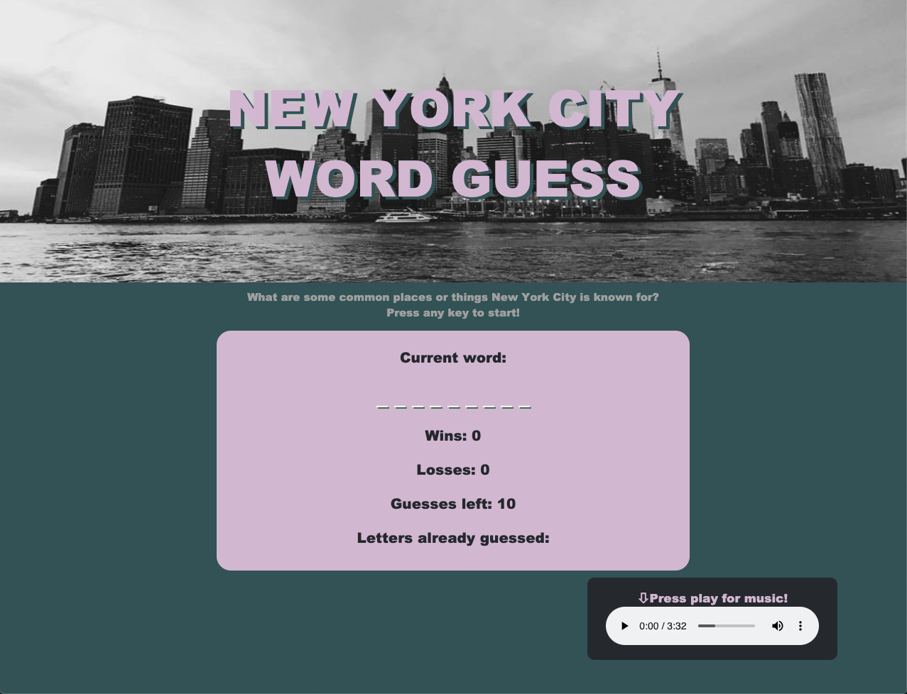

# Word-Guess-Game
**Link to Game: https://joditivis.github.io/Word-Guess-Game/**

# About:
University of Denver Coding Boot Camp third week assignment: Required us to build a Word Guess Game using JavaScript.
---
# How to Play:
- New York City Theme and Category: What are some common places or things New York City is known for?

- Guess the correct word before you run out of guesses to receive a win point for that round!

- If you run out of guesses before completing the word, a loss point is added for that round.

- Try to get more wins than losses!

- Listen to a little tune while you play!

- When you see a " - " in the current word, it is representing a space
---
# Tools + Languages Used:
* HTML5 - markup language
* CSS3 - styling
* JavaScript - programming language

* Page Colors found on https://coolors.co/3d3522-4a442d-386150-58b09c-caf7e2
* Song by Taylor Swift found on https://mp3direct.org/

# Features:

